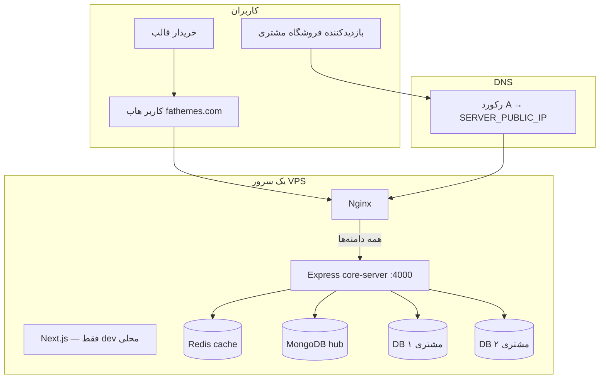

# معماری Managed Site — Express واحد + چندمستاجری

> **سند مرجع اصلی** برای فروش قالب، provisioning، و سایت‌های مشتری در `store-app`.  
> مسیر: `docs/MANAGED-SITE-ARCHITECTURE.md`  
> آخرین به‌روزرسانی: مهاجرت تدریجی از Next.js به **یک Express** (`core-server`) برای همه دامنه‌ها.

---

## ۱. خلاصه تصمیم معماری

| موضوع | تصمیم |
|--------|--------|
| وب‌سرور production | **یک Express** (`packages/core-server`) |
| هاب `fathemes.com` | **Express** در production (`npm run dev` برای Next اختیاری) |
| هر مشتری | **بدون** وب‌سرور جدا — فقط DB جدا (+ پوشه uploads سبک) |
| قالب‌ها (`site-templates/`) | پکیج UI/API — dev با Next؛ production از Express |
| دیتابیس | **MongoDB** — هاب یک DB؛ هر مشتری یک DB جدا |
| DNS فعلی | **رکورد A** به IP سرور (nameserver اختصاصی = فاز بعدی) |
| Next.js نهایی | **حذف از production** — فقط `docker-compose.next-dev.yml` / `npm run dev` |

---

## ۲. نمای کلی سیستم



---

## ۳. سناریوی تأییدشده (خرید تا بالا آمدن سایت)

### ۳.۱ مراحل

1. قالب در `site-templates/{slug}/` ساخته و در `/admin/site-templates` ثبت می‌شود.
2. محصول DIGITAL با `managed-site` + انتخاب قالب.
3. مشتری خرید می‌کند و **دامنه** را در checkout وارد می‌کند.
4. `runProvision()` اجرا می‌شود.
5. برای مشتری ساخته می‌شود:
   - رکورد در `siteInstances` (hub DB)
   - **MongoDB جدا** (`shop_{slug}`)
   - پوشه سبک `provisioned-sites/{slug}/uploads`
   - **ادمین پیش‌فرض** در DB همان سایت
   - فایل Nginx → Express
6. مشتری **رکورد A** می‌زند: `@ → SERVER_PUBLIC_IP`
7. cron DNS را چک می‌کند → `active`
8. کاربر دامنه را باز می‌کند → **همان Express** با `Host` همان سایت + DB همان مشتری را لود می‌کند.

### ۳.۲ نکات مهم

| موضوع | توضیح |
|--------|--------|
| وب‌سرور per مشتری | **خیر** — فقط یک Express |
| پوشه per دامنه | بله — فقط uploads/فایل اختصاصی |
| DB per مشتری | بله — جداسازی کامل داده |
| دو nameserver | **فعلاً نه** — رکورد A |
| ادمین سایت | در DB مشتری + نمایش در `/user/my-sites` |

---

## ۴. Express core-server

### ۴.۱ Host-based routing

```ts
app.use(async (req, res, next) => {
  const host = req.hostname.replace(/^www\./, '');

  if (isHubDomain(host)) {
    req.ctx = { type: 'hub', db: await getHubDb() };
    return next();
  }

  const instance = await resolveTenant(host); // Redis → siteInstances
  if (!instance || instance.status !== 'active') {
    return res.status(404).send('سایت یافت نشد');
  }

  req.ctx = {
    type: 'tenant',
    instance,
    db: await getTenantDb(instance.databaseName),
    templateSlug: instance.templateSlug,
  };
  next();
});
```

### ۴.۲ قالب‌ها

```ts
// site-templates/shop-starter-v1/register.ts
export const template = {
  slug: 'shop-starter-v1',
  registerRoutes(app, ctx) { /* API + static */ },
  seed(db) { /* محصولات، siteContent، admin */ },
};
```

---

## ۵. ساختار پوشه

```
store-app/
├── docs/
│   └── MANAGED-SITE-ARCHITECTURE.md    ← این سند
├── packages/
│   ├── core-server/                    # Express (hub + tenant)
│   │   └── src/hub/                    # API هاب — فاز ۳
│   ├── core-shared/                    # lib/db مشترک
│   ├── hub-routes/
│   └── tenant-routes/
├── site-templates/
│   └── shop-starter-v1/
│       ├── register.ts
│       └── express/                    # API production (فاز ۲)
├── provisioned-sites/{slug}/uploads/
├── src/                                # Next.js هاب (موقت)
├── nginx/sites/                        # vhost مشتریان
└── project-docs/managed-site-setup.md  # راه‌اندازی عملی
```

---

## ۶. Nginx (حالت نهایی)

```nginx
upstream core_server {
    server 127.0.0.1:4000;
}

server {
    listen 443 ssl http2;
    server_name shop-moshtari.com www.fathemes.com;
    location / {
        proxy_pass http://core_server;
        proxy_set_header Host $host;
    }
}
```

---

## ۷. سرعت — اولویت‌ها

```
۱. MongoDB index
۲. Redis cache (host → tenant)
۳. Nginx static
۴. Express + PM2 cluster
```

MongoDB عوض نمی‌شود — با index و cache کافی است.

---

## ۸. فازبندی مهاجرت

| فاز | کار | Next hub |
|-----|-----|----------|
| ۰ | مستندات | فعال |
| ۱ | `packages/core-server` + health + host middleware | ✅ |
| ۲ | tenant shop-starter-v1 — API کامل | ✅ [جزئیات](./CORE-MIGRATION-PHASE-2.md) |
| ۲b | tenant UI shell + static uploads | ✅ [جزئیات](./CORE-MIGRATION-PHASE-2B.md) |
| ۳ | hub API managed + public | ✅ [دسته ۱](./CORE-MIGRATION-PHASE-3.md) |
| ۳b | hub auth + shop + payment | ✅ [جزئیات](./CORE-MIGRATION-PHASE-3B.md) |
| ۳c | hub API باقی‌مانده | ✅ [جزئیات](./CORE-MIGRATION-PHASE-3C.md) |
| ۴ | hub UI → Express | ✅ [جزئیات](./CORE-MIGRATION-PHASE-4.md) |
| ۵ | provisioning جدید | ✅ [جزئیات](./CORE-MIGRATION-PHASE-5.md) |
| ۶ | Nginx + Docker | ✅ [جزئیات](./CORE-MIGRATION-PHASE-6.md) |
| ۷ | حذف Next از production | ✅ [جزئیات](./CORE-MIGRATION-PHASE-7.md) |

---

## ۹. env

```env
MONGODB_URI=mongodb://...
SERVER_PUBLIC_IP=1.2.3.4
PROVISIONING_ENABLED=true
REDIS_URL=redis://...
CORE_SERVER_PORT=4000
HUB_DOMAINS=fathemes.com,www.fathemes.com
TENANT_ADMIN_EMAIL=admin@muse.local
TENANT_ADMIN_PASSWORD=...
```

`PROVISION_PORT_START` منسوخ است.

---

## ۱۰. فایل‌های کد

| فایل | نقش |
|------|-----|
| `src/lib/provisioning/run-provision.ts` | orchestration |
| `src/lib/provisioning/create-database.ts` | ساخت DB tenant |
| `src/lib/provisioning/nginx-config.ts` | vhost |
| `src/lib/provisioning/dns-checker.ts` | رکورد A |
| `site-templates/shop-starter-v1/register.ts` | ثبت routes در core-server |
| `site-templates/shop-starter-v1/express/routes.ts` | APIهای tenant |
| `packages/core-server/src/middleware/tenant-static.ts` | `/uploads` per tenant |
| `site-templates/shop-starter-v1/express/ui/` | HTML shell فروشگاه |

---

## ۱۱. مستندات مرتبط

| فایل | موضوع |
|------|--------|
| [project-docs/managed-site-setup.md](../project-docs/managed-site-setup.md) | راه‌اندازی عملی |
| [project-docs/archtech.md](../project-docs/archtech.md) | معماری کلی هاب |
| [site-templates/README.md](../site-templates/README.md) | قوانین قالب‌ها |
| [site-templates/shop-starter-v1/docs/fullstack-architecture.md](../site-templates/shop-starter-v1/docs/fullstack-architecture.md) | معماری قالب |
| [CORE-MIGRATION-INDEX.md](./CORE-MIGRATION-INDEX.md) | فهرست فازهای مهاجرت |
| [CORE-MIGRATION-PHASE-2.md](./CORE-MIGRATION-PHASE-2.md) | API فاز ۲ |
| [CORE-MIGRATION-PHASE-2B.md](./CORE-MIGRATION-PHASE-2B.md) | UI + static فاز ۲b |
| [CORE-MIGRATION-PHASE-3.md](./CORE-MIGRATION-PHASE-3.md) | API هاب دسته ۱ |
| [CORE-MIGRATION-PHASE-3B.md](./CORE-MIGRATION-PHASE-3B.md) | auth + shop + payment |
| [CORE-MIGRATION-PHASE-3C.md](./CORE-MIGRATION-PHASE-3C.md) | categories + mega-menu |
| [CORE-MIGRATION-PHASE-5.md](./CORE-MIGRATION-PHASE-5.md) | provisioning جدید |
| [CORE-MIGRATION-PHASE-4.md](./CORE-MIGRATION-PHASE-4.md) | hub UI |
| [CORE-MIGRATION-PHASE-6.md](./CORE-MIGRATION-PHASE-6.md) | Docker + Nginx |
| [CORE-MIGRATION-PHASE-7.md](./CORE-MIGRATION-PHASE-7.md) | حذف Next |

---

## ۱۲. چک‌لیست «تمام شد»

- [x] یک Express همه دامنه‌های active
- [x] provisioning: DB + seed + admin + nginx (بدون port per tenant)
- [x] credentials ادمین در my-sites
- [ ] مشتری با رکورد A سایت را می‌بیند (نیاز به استقرار واقعی)
- [x] Next.js از production حذف شده
