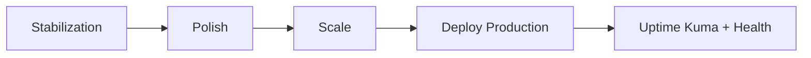

# Roadmap — نقشه راه پروژه

آخرین به‌روزرسانی: ژوئن ۲۰۲۶

## ۱. نقطه شروع (Baseline)

پروژه از یک **فروشگاه دیجیتال فارسی** با این پایه شروع شده:

- Next.js 15 + MongoDB + Tailwind
- فروش محصولات وردپرس (قالب/افزونه)
- پنل ادمین و API-first architecture
- استقرار Docker

**وضعیت اولیه:** CRUD پایه محصول، احراز هویت، و ساختار monolithic Next.js.

---

## ۲. نقطه پایان (هدف نهایی)

یک **پلتفرم production-ready** با این ویژگی‌ها:

| حوزه | هدف نهایی |
|------|-----------|
| فروش | checkout پایدار، پرداخت، تحویل فوری دیجیتال |
| لایسنس | verify خودکار در سایت مشتری (وردپرس) |
| SEO | URL یکتا، بدون duplicate، ایندکس کامل |
| امنیت | بدون debug endpoint، auth کامل admin |
| عملکرد | LCP < 2.5s، Redis cache فعال |
| عملیات | cron ایمیل/SMS، backup خودکار، monitoring |
| کد | بدون فایل legacy/backup، یک سرویس canonical |

---

## ۳. وضعیت فعلی (ژوئن ۲۰۲۶)

### ✅ تکمیل شده (~۹۸٪)

| حوزه | وضعیت | مرجع |
|------|--------|------|
| فروشگاه کامل | کاتالوگ، سبد، checkout، Zarinpal/Zibal | — |
| پنل ادمین | ~۹۵ صفحه، ~۲۰۰ API | `archtech.md` |
| امنیت + SEO + Polish | فازهای Q2–Q3 | `security-phase5.md`, `seo-phase3.md`, `polish-phase-q3.md` |
| **Q4 Scale** | Redis، CDN، backup، monitoring، OpenAPI | `scale-phase-q4.md` |
| Deploy / verify | `verify:bugs`, `verify:polish`, `verify:scale`, `test` | `debug.md` |

### 🔄 باقی‌مانده جزئی (~۲٪)

| مورد | توضیح |
|------|--------|
| `reactStrictMode: true` | فعلاً `false` — بعد از رفع hydration warnings |
| `dynamicContent` خالی | `npm run db:seed` |
| تست دستی payment | sandbox + production قبل از deploy نهایی |
| OpenAPI admin APIs | spec فعلی فقط APIهای عمومی را پوشش می‌دهد |

---

## ۴. کارهای انجام‌شده (مرجع)

```
[x] Q2 Stabilization — امنیت، SEO URL، maintenance، cron email
[x] Q3 Polish — Next Rocket، SMS facade، perf audit، tests
[x] Q4 Scale — Redis production، CDN، backup cron، Sentry، OpenAPI
```

---

## ۵. اولویت‌های فعلی

### Deploy روی سرور

```
[ ] npm run deploy:check:prod
[ ] npm run verify:bugs && npm run verify:polish && npm run verify:scale
[ ] npm run db:seed && npm run scale:seed
[ ] npm run db:backup (تست اولین بک‌آپ)
[ ] curl /api/health/scale → ready: true
[ ] تست payment sandbox + production
```

### بعداً (اختیاری)

```
[ ] reactStrictMode: true
[ ] گسترش OpenAPI به admin APIها
[ ] CDN خارجی (Cloudflare R2 / Bunny) در صورت نیاز ترافیک بالا
```

---

## ۶. Roadmap فازبندی

### Q2 2026 — Stabilization ✅

- [x] هسته فروشگاه، پرداخت، لایسنس
- [x] امنیت production، SEO URL، maintenance mode
- [x] cron email wiring

### Q3 2026 — Polish ✅

- [x] Next Rocket v1
- [x] email automation، performance audit، SMS یکپارچه
- [x] legacy cleanup، `npm run test`

> [polish-phase-q3.md](./polish-phase-q3.md)

### Q4 2026 — Scale ✅

- [x] **Redis اجباری در production** — `deploy-checks.ts`, `docker-compose.yml`, `REDIS_ENABLED=true`
- [x] **CDN static/uploads** — Nginx `/uploads/` + `src/lib/cdn.ts` + `assetPrefix` اختیاری
- [x] **Monitoring** — Uptime Kuma (docker `:3001`) + Sentry اختیاری (`SENTRY_DSN`)
- [x] **Backup/restore** — `mongodb-backup.ts`, `npm run db:backup`, cron `database_backup` (`npm run scale:seed`)
- [x] **OpenAPI** — `data/openapi.json`, `GET /api/openapi`, `GET /api/health/scale`

> [scale-phase-q4.md](./scale-phase-q4.md)

---

## ۷. معیار «آماده Production»

| معیار | وضعیت |
|-------|--------|
| `npm run build` بدون error | ⏳ قبل از deploy |
| debug/test API مسدود در production | ✅ |
| admin APIهای حساس محافظت‌شده | ✅ |
| maintenance mode | ✅ |
| SEO URL audit | ✅ |
| Redis در production | ✅ |
| backup روزانه | ✅ (cron + `db:backup`) |
| monitoring | ✅ (Uptime Kuma + Sentry اختیاری) |
| OpenAPI عمومی | ✅ `/api/openapi` |
| `.env` فقط runtime | ✅ |
| `verify:bugs` / `verify:polish` / `verify:scale` | ✅ |

---

## ۸. وابستگی‌ها



---

## ۹. مستندات و دستورات

| سند | موضوع |
|------|--------|
| [archtech.md](./archtech.md) | معماری |
| [debug.md](./debug.md) | باگ‌های BUG-001–007 |
| [seo-phase3.md](./seo-phase3.md) | SEO |
| [security-phase5.md](./security-phase5.md) | امنیت production |
| [polish-phase-q3.md](./polish-phase-q3.md) | Q3 Polish |
| [scale-phase-q4.md](./scale-phase-q4.md) | Q4 Scale |

```bash
npm run verify:bugs
npm run verify:polish
npm run verify:scale
npm run test
npm run deploy:check
npm run db:seed
npm run scale:seed
npm run db:backup
npm run perf:audit          # بعد از npm run build
curl http://localhost:3000/api/health/scale
```
